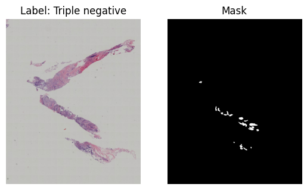

<h1>AN2DL [2025-2026] - Challenge 2: Image Classification</h1>

- [Overview](#overview)
- [Prerequisites](#prerequisites)
- [Dataset Description](#dataset-description)
    - [👹 The Grumpy Doctogres Challenge](#-the-grumpy-doctogres-challenge)
    - [🧌 The Grunt Work: Molecular Subtype Classification](#-the-grunt-work-molecular-subtype-classification)
    - [🪨 Files](#-files)
    - [🧭 Data Overview](#-data-overview)
    - [🗺️ Validation](#-validation)

---

## Overview

This repository contains the dataset and baseline code for the AN2DL 2025-2026 Challenge 2: Image Classification.

Team members:
- [Andrea Valentini](https://github.com/AndreVale69/)
- [Alberto Ondei](https://github.com/Onda02)
- [Filippo Barbari](https://github.com/Ledmington)
- [Abdullah Javed](https://github.com/JavedAbdullah)

---

## Prerequisites

Since data files are large, you need to download git-lfs to clone this repository:

```bash
# Install git-lfs (if not already installed)
curl -s https://packagecloud.io/install/repositories/github/git-lfs/script.deb.sh | sudo bash
sudo apt-get install git-lfs

# Initialize git-lfs in your repository (once per machine)
git lfs install

# Clone the repository
git clone <repository-url>
cd AN2DL-Challenge-2
# Pull the large data files
git lfs pull
```

> [!TIP]
> If you have already cloned the repository without git-lfs, run the following commands inside the repository folder:
>
> ```bash
> git lfs install
> git lfs pull
> ```

Now, you should have all the data files in place.
To run the provided notebooks, make sure you have the required Python packages installed:

```bash
# Create a virtual environment
cd AN2DL-Challenge-2 # if not already in the repo folder
python3 -m venv .venv
source .venv/bin/activate  # On Windows use .venv\Scripts\activate
# Install jupyter
pip install jupyter ipykernel
```

If you are still having issues, please refer to the [official python venv documentation](https://docs.python.org/3/library/venv.html) for more details on setting up virtual environments.

Once the environment is set up, run the prerequisite notebook to install all other dependencies (CPU or GPU version):

```bash
jupyter notebook
```

And navigate to the notebook files in your web browser (usually at `http://localhost:8888`).

---

## Dataset Description

Competition hosted at [AN2DL 2025-2026](https://www.kaggle.com/competitions/an2dl2526c2v2).

### 👹 The Grumpy Doctogres Challenge

Welcome aboard, engineer! You’ve been assigned to the Iron-Guts Hospital,
a state-of-the-art medical facility staffed entirely by orcs with questionable bedside manners.

Your mission: design a deep learning model that can classify diseased human tissue samples.
Success means better prognostics for our fragile human patients - and possibly a promotion to Chief Slag-Wrangler.


### 🧌 The Grunt Work: Molecular Subtype Classification

Your task is to analyze microscopic tissue morphology and predict the correct **molecular subtype**.
These labels tell our orc surgeons which surgical instrument to swing next:

 - **Luminal A**: Usually the squishiest
 - **Luminal B**: A bit tougher
 - **HER2(+)**: Requires heavy ordnance
 - **Triple Negative**: The tricky ones; bring the precision club

### 🪨 Files

The dataset contains **1,272 images** of different sizes,
each paired with a binary mask crafted by our team of dedicated doctogres.
These masks identify the regions most likely to contain the diseased tissue.
Our staff guarantees that the dataset has been collected in a completely orc-skin-free, booger-free,
and absolutely sterile environment.

Create a table summarizing the dataset, including:

| **File Location** | **Description**                                                    |
|-------------------|--------------------------------------------------------------------|
| train_data.zip    | **691** image/mask pairs for model training                        |
| test_data.zip     | **477** image/mask pairs for final evaluation (no labels provided) |
| train_labels.csv  | Ground-truth molecular subtype labels for the training set         |

The following is an example image with the corresponding auxiliary mask.
The use of masks is optional for classification purposes, but may be helpful. Ogres do not waste.




### 🗺️ Validation

No validation ~~sacrifice~~ split is provided by default.
